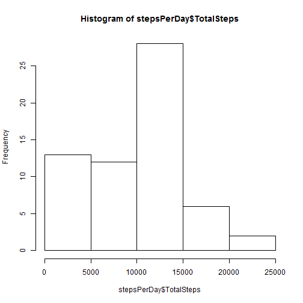
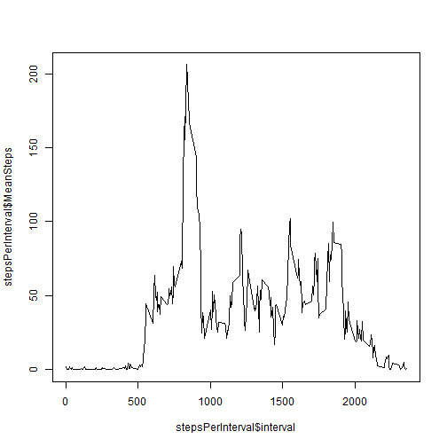
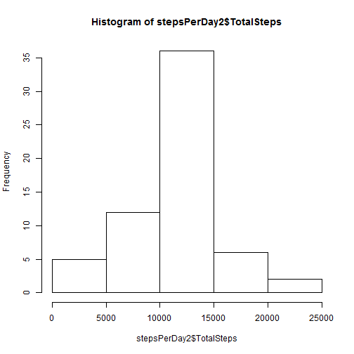
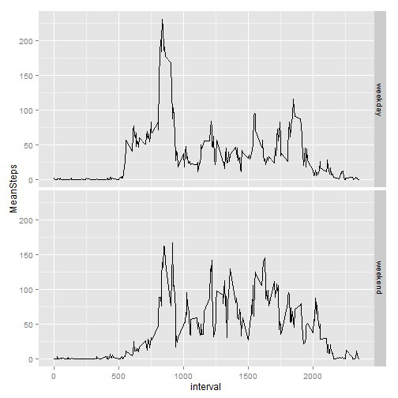

## Loading and preprocessing the data
###1. Load the data (i.e. read.csv())
Load data and store to a variable called "act".


```r
act <- read.csv("activity.csv")
```

###2. Process/transform the data (if necessary) into a format suitable for your analysis

The data is in a suitable format already. Any additional summarization required will be carried out using ddply.

## What is mean total number of steps taken per day?
Introduce the plyr library to make use of ddply.

```r
library(plyr)
```
### 1. Calculate the total number of steps taken per day
Use ddply to group data by date and sum the number of steps for each date. Store result as "stepsPerDay".
Display the first several days using "head".

```r
stepsPerDay <- ddply(act, .(date), summarize, TotalSteps=sum(steps, na.rm=TRUE))
head(stepsPerDay)
```

```
##         date TotalSteps
## 1 2012-10-01          0
## 2 2012-10-02        126
## 3 2012-10-03      11352
## 4 2012-10-04      12116
## 5 2012-10-05      13294
## 6 2012-10-06      15420
```

### 2. Make a histogram of the total number of steps taken each day

```r
hist(stepsPerDay$TotalSteps)
```

 

### 3. Calculate and report the mean and median of the total number of steps taken per day


```r
mean(stepsPerDay$TotalSteps)
```

```
## [1] 9354.23
```

```r
median(stepsPerDay$TotalSteps)
```

```
## [1] 10395
```

## What is the average daily activity pattern?
###1. Make a time series plot (i.e. type = "l") of the 5-minute interval (x-axis) and the average number of steps taken, averaged across all days (y-axis)

```r
stepsPerInterval <- ddply(act, .(interval), summarize, MeanSteps=mean(steps, na.rm=TRUE))
plot(stepsPerInterval$interval, stepsPerInterval$MeanSteps, type="l")
```

 

###2. Which 5-minute interval, on average across all the days in the dataset, contains the maximum number of steps?
Introduce the nnet library to make use of which.is.max and then output the answer

```r
library(nnet)
stepsPerInterval$interval[which.is.max(stepsPerInterval$MeanSteps)]
```

```
## [1] 835
```
So then the 5 minute invertal with the maximum average number of steps is between 8:35AM and 8:40AM.

## Imputing missing values
### 1. Calculate and report the total number of missing values in the dataset (i.e. the total number of rows with NAs)

```r
length(which(is.na(act$steps)))
```

```
## [1] 2304
```
### 2. Devise a strategy for filling in all of the missing values in the dataset. The strategy does not need to be sophisticated. For example, you could use the mean/median for that day, or the mean for that 5-minute interval, etc.
**Use average for time interval**
Make a specialized function that does the replacement. I choose to replace with the "mean for that 5-minute interval".


```r
ReplaceNAWithMean <- function(df)
{
  require(plyr)
  rplc <- ddply(df, .(interval), summarize, MeanSteps=mean(steps, na.rm=TRUE))
  for(i in 1:nrow(df))
  {
    if(is.na(df[i,]$steps))
    {
      period <- df[i,]$interval
      df[i,]$steps <- rplc$MeanSteps[which(rplc$interval==period)]
    }
  }
  return(df)
}
```

### 3. Create a new dataset that is equal to the original dataset but with the missing data filled in
Now use the function created above.


```r
act2 <- ReplaceNAWithMean(act)
```

### 4. Make a histogram of the total number of steps taken each day and Calculate and report the mean and median total number of steps taken per day. Do these values differ from the estimates from the first part of the assignment? What is the impact of imputing missing data on the estimates of the total daily number of steps?

```r
stepsPerDay2 <- ddply(act2, .(date), summarize, TotalSteps=sum(steps, na.rm=TRUE))
hist(stepsPerDay2$TotalSteps)
```

 

```r
mean(stepsPerDay2$TotalSteps)
```

```
## [1] 10766.19
```

```r
median(stepsPerDay2$TotalSteps)
```

```
## [1] 10766.19
```

The mean and median both change as a result of replacing the NAs. They both increase as does the total number of steps.

As a check, I'd like to also see the mean and median of the average steps, across days, taken per interval. I do not expect this to change after replacing with the means. I'll show the mean and median of the work in #1 under the heading **What is the average daily activity pattern?** to verify the match.


```r
mean(stepsPerInterval$MeanSteps)
```

```
## [1] 37.3826
```

```r
median(stepsPerInterval$MeanSteps)
```

```
## [1] 34.11321
```

```r
stepsPerInterval2 <- ddply(act2, .(interval), summarize, MeanSteps=mean(steps, na.rm=TRUE))
#hist(stepsPerInterval2$MeanSteps)
mean(stepsPerInterval2$MeanSteps)
```

```
## [1] 37.3826
```

```r
median(stepsPerInterval2$MeanSteps)
```

```
## [1] 34.11321
```

## Are there differences in activity patterns between weekdays and weekends?
### 1. Create a new factor variable in the dataset with two levels – “weekday” and “weekend” indicating whether a given date is a weekday or weekend day.


```r
act2$DayType <- factor(ifelse(weekdays(as.Date(act2$date)) == "Saturday" | weekdays(as.Date(act2$date)) == "Sunday", "weekend", "weekday" ))
```

### 2. Make a panel plot containing a time series plot (i.e. type = "l") of the 5-minute interval (x-axis) and the average number of steps taken, averaged across all weekday days or weekend days (y-axis).


```r
library(ggplot2)
stepsPerInterval2ByDayType <- ddply(act2, .(interval, DayType), summarize, MeanSteps=mean(steps, na.rm=TRUE))
ggplot(stepsPerInterval2ByDayType, aes(x=interval, y=MeanSteps)) + geom_line() + facet_grid(DayType ~ .)
```

 
